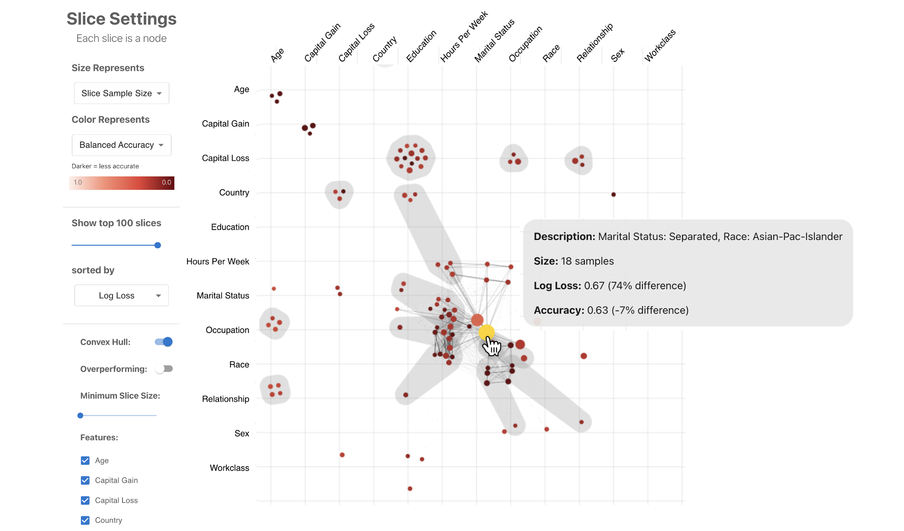

# Visual Auditor
[](https://opensource.org/licenses/MIT)

An interactive visualization system for identifying and understanding biases in machine learning models.



## Working Demo

A live demo is available at the following link:
https://visual-auditor.surge.sh/

It runs on most modern web browsers. We suggest you use Google Chrome.

## Development (Web Application)

This section describes how you to up the visual auditor web application for development.

### Install Dependencies

Run the following commands:

```bash
$ git clone https://github.com/poloclub/visual-auditor.git
$ cd visual-auditor
$ cd visual-auditor-app
$ npm install
```

It's unlikely, but you may need to install some basic JavaScript-related dependencies (e.g., npm).

## Available Scripts

In the project directory, you can run:

### `npm start`

Runs the app in the development mode.\
Open [http://localhost:3000](http://localhost:3000) to view it in the browser.

The page will reload if you make edits.\
You will also see any lint errors in the console.

### `npm run build`

Builds the app for production to the `build` folder.\
It correctly bundles React in production mode and optimizes the build for the best performance.

The build is minified and the filenames include the hashes.\
Your app is ready to be deployed!

See the section about [deployment](https://facebook.github.io/create-react-app/docs/deployment) for more information.

## Development (Notebook Widget)

This section describes how to set up the visual auditor notebook widget for development.

### Install Dependencies

Run the following commands:

```bash
$ git clone https://github.com/poloclub/visual-auditor.git
$ cd visual-auditor
$ cd visual-auditor-package
$ npm install
```

It's unlikely, but you may need to install some basic JavaScript-related dependencies (e.g., npm).

## Running Locally

Launch Jupyter Notebook (or a computational notebook of your choice) and navigate to the `visual-auditor-package/notebook-widget/visual-auditor` directory. Choose between the `adult.ipynb`, `german_credit.ipynb`, or `customer_churn.ipynb` demo notebook files to test the visual auditor within an example data science workflow. 

## Available Scripts

In the project directory, you can run:

### `npm run build`

Builds the app for production to the `build` folder.\
It bundles the application into a single `index.html` file.\
To update the notebook widget, copy the contents of this file over to the `bundle.html` file within the `notebook-widget/visual-auditor` directory.

## Credits
The **Visual Auditor** was developed and maintained by [David Munechika](https://github.com/davidmunechika), [Jay Wang](https://github.com/xiaohk), and [Polo Chau](https://www.cc.gatech.edu/~dchau/) from the [Polo Club of Data Science](https://poloclub.github.io/) at Georgia Tech.

## License
The **Visual Auditor** is available under the  [MIT License](LICENSE).
The **Visual Auditor** uses the D3.js which is licensed under the [ISC License](https://github.com/d3/d3/blob/main/LICENSE) and React.js which is licensed under the [MIT License](https://github.com/facebook/react/blob/main/LICENSE).